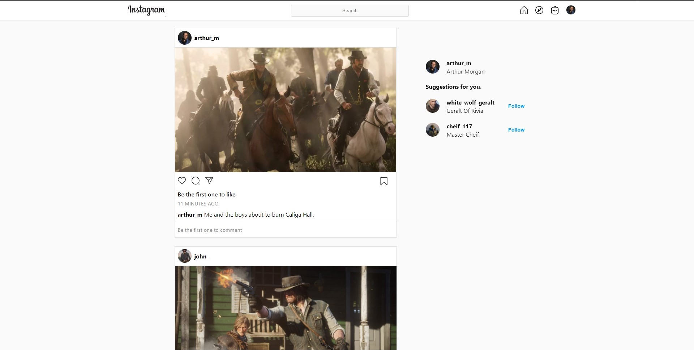
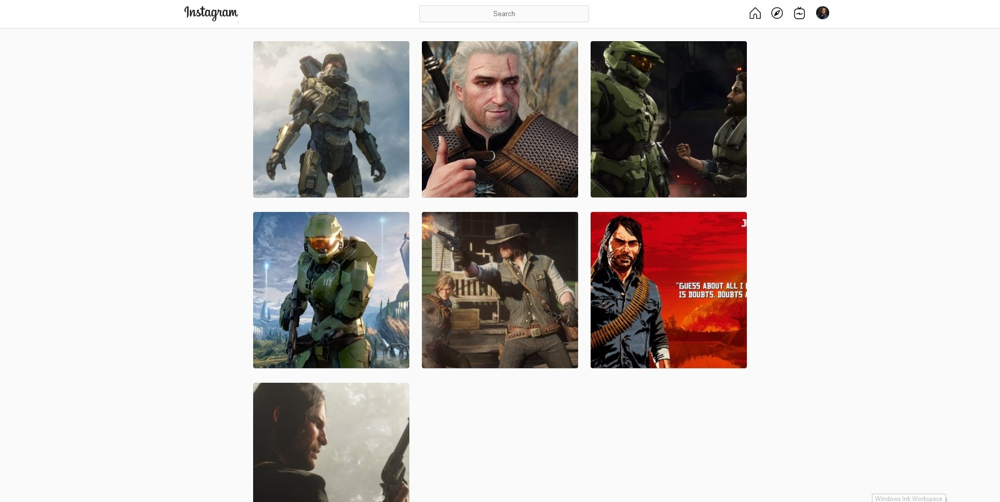
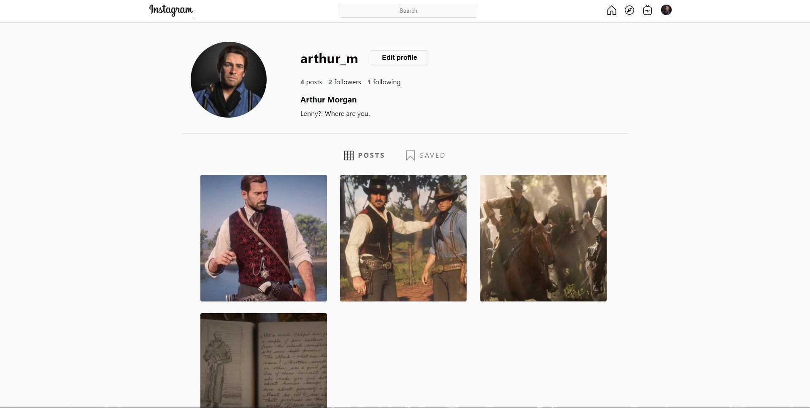
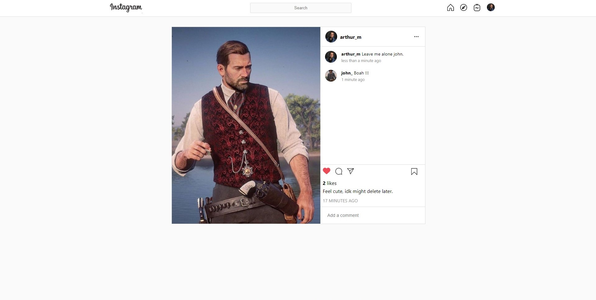

## Instagram Clone Backend

# Check out frontend [here](https://github.com/vikS7/instagram-clone-frontend)
> An Instagram clone made using React.js, Redux.js and Node.js

## Screenshots
 Homepage
 

 
 Explore



User Profile



Post




## Installation

Clone the repo:

```

git clone --depth https://github.com/vikS7/instagram-clone-backend.git
cd instagram-clone-backend

```
Install the dependencies:

```

npm install

```

Set the enviornment variables in src/config/dev.env


## Commands 

Running locally :  ``npm run start``

Running in production :  ``npm run dev``


## Environment variables

The environment variables can be modified in the `.env` file. Deafault values are :
```

#Port number
PORT=3010

#URL of MongoDB
MONGODB_URL=mongodb://127.0.0.1:27017/{database_name}

#JWT SECRET KEY
JWT_ENCRY_KEY={ENCRYPTION_KEY}

```


## Authentication

To user authentication for certain routes, simply add 'auth' middleware. 


## Dependencies

- "bcrypt": "^5.0.0",
- "express": "^4.17.1",
- "jsonwebtoken": "^8.5.1",
- "mongoose": "^5.11.10",
- "morgan": "^1.10.0",
- "validator": "^13.5.2",
- "env-cmd": "^10.1.0",
- "nodemon": "^2.0.6",
- "cors: "^2.8.5",
- "multer": "^1.4.2"
- "sharp": "^0.27.2"
